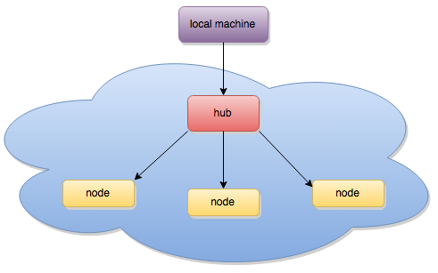
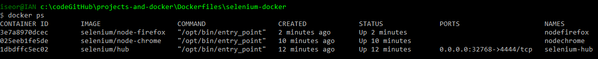

Dockerizando Selenium
=======

Contrucción de un Selenium Grid  
  

1. Pull and Run del contenedor hub  
    <pre>docker run -d -P --name selenium-hub selenium/hub</pre>
2. Pull and Run del contenedor del nodo `selenium/node-chrome` 
    <pre>docker run -d --link selenium-hub:hub selenium/node-chrome</pre>
3. Pull and Run del contenedor del nodo `selenium/node-firefox`  
    <pre>docker run -d --link selenium-hub:hub selenium/node-firefox</pre>

 

 ## Referencia
 [Docker Selenium. Getting Started](https://www.youtube.com/watch?v=S4OkrnFb-YY)  
 [Protractor-cookbook](https://github.com/angular/protractor-cookbook)  
 [SeleniumHQ](https://github.com/SeleniumHQ/docker-selenium/blob/master/README.md)  
 [Docker Hub](https://hub.docker.com/u/selenium/)