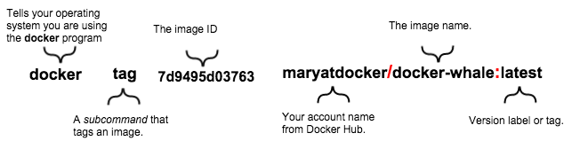

# Docker #

## Índice
[**Iniciar docker en Windows**](#iniciar-docker-en-windows)  
[**Despliegue en heroku**](#despliegue-en-heroku)  
[**Construcción de imagen**](#construccion-de-imagen)    
[**Comandos mas usados Docker**](#comandos-mas-usados-docker)  
[**Tag push and pull**](#tag-push-and-pull)  
[**Comandos Docker Machine**](#comandos-docker-machine)

## Instalar Docker ToolBox en Windows
1. Descargar [**ToolBox**](https://www.docker.com/products/docker-toolbox)  
## Iniciar docker en windows 
1. Iniciar machina de docker 
    <pre>docker-machine start default</pre>
2. Establecer las variables de entorno 
    <pre>docker-machine env default</pre>
3. Terminar configuración 
    <pre>@FOR /f "tokens=*" %i IN ('docker-machine env default') DO @%i</pre>

### Referencias
>**[Docker Machine Overview](https://docs.docker.com/machine/overview/)**

## Despliegue en heroku
* Login en heroku  
    <pre> heroku login</pre>
* Crear app en heroku
    <pre> heroku create <nombre app></pre>
* Asignar app en la cual se realizara el Deploy
    <pre> heroku git:remote -a  <nombre app></pre>
* Iniciar login en el container a desplegar 
    <pre>heroku container:login</pre>
* Push a heroku
    <pre>heroku container:push web --app <nombre app></pre>
* Push heroku forma normal
    <pre>git push heroku master --app <nombre app></pre>

### Referencias
> **[Container Registry and Runtime](https://devcenter.heroku.com/articles/container-registry-and-runtime)**

> **[Heroku Node.js Docker Image](https://hub.docker.com/r/heroku/nodejs/)** 

## Construcción de imagen
* Crear archivo `Dockerfile`
    <pre> FROM {count docker hub}/{nombre de imagen}:{tag}  
    RUN {ejecuta directamente el comando dentro de el contenedor, y luego persiste los cambios}
    ENV {establece variables de ambiente de nuestro contenedor}
    CMD {Comandos a ejecutar cuando se corre la imagen}
    ADD {Agregar archivos a la imagen}
    EXPOSE {Asociación de puertos}
    WORKDIR {Establecer directorio de trabajo donde se ejecutaran comandos}
* Comando de creación de imagen:
    <pre>docker build -f DockerfileBase --force-rm -t isortegah/nodejs:v1 .</pre>
* Correr la imagen mostrando el bash.
    <pre>docker run -it isortegah/nodejs:v1 /bin/bash</pre>

## Tag push and pull

### Push 
Estructura del comando para crear tag
  
* Comando para crear tag:
    <pre>docker tag d5e2056ec48c isortegah/nodejs:v1</pre>
* Iniciar sesión en docker hub 
    <pre>docker login</pre>
* Hacer push:
<pre>docker push isortegah/nodejs:v1</pre>

### Pull 

### Referencias  

[**Como construir imagenes**](http://codehero.co/como-construir-imagenes-usando-dockerfiles/)

## Comandos mas usados Docker-Machine

* Crear Docker Machine   
<pre>docker-machine create < nombre ></pre>

## Comandos mas usados Docker

* Listar imagenes
    <pre>docker images</pre>
* Limpiamos todos los contenedores en estado `Exited`:  
    <pre>docker rm $(docker ps -a | grep Exit | cut -d ' ' -f 1)</pre>
* Eliminar imagen
    <pre>docker rmi -f </pre>

## Comandos Docker Machine

* Crear docker-machine
    <pre>docker-machine create --driver virtualbox dev</pre>
* Listar docker-machine
    <pre>docker-machine ls</pre>
* Elimina docker-machine
    <pre>docker-machine rm {nombre machine}</pre>

### Referencias
>[Docker Machine](https://docs.docker.com/machine/reference/)
